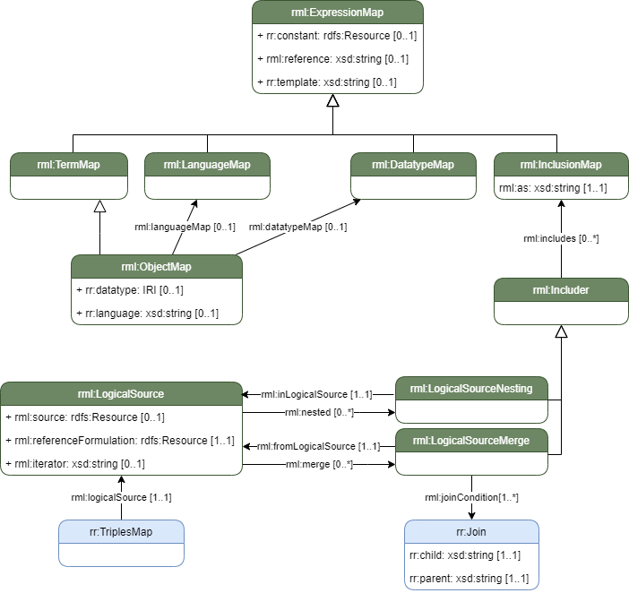

# Solution using Logical Source Merges and Nestings

This solution introduces Inclusions, Logical Source Merges and Nestings, and related constructs, to tackle the challenge of accessing fields outside a logical source iteration.

The aim is to stay close to the current workings of RML, but expand the functionality of the iteration model in a "modular" fashion. Modular in the sense that the functionality of other language constructs are not affected by this addition to the language.

This approach is influenced by [XR2RML's "push down"](https://www.i3s.unice.fr/~fmichel/xr2rml_specification.html#_Toc466307461) property, but aims to introduce a reusable construct that can push values down a sub-level, but also merge data from different iterations or even data sources.

The following is an overview of the new constructs in relation to existing constructs in RML.



## Inclusions

Inclusions provide a way to include an expression result from one logical source iteration record as part of the content of another logical source iteration record.

To specify this, we introduce the (abstract) class `rml:Includer`. We make it abstract so that inclusions could be used in different RML language constructs.

An `rml:Includer` has
* 0 or more `rml:includes` relationships to `rml:InclusionMap`s.

An `rml:InclusionMap` is a `rdfs:subClassOf` `rml:ExpressionMap` (to be described in a different document) and can have one of
* `rr:constant`,
* `rml:reference`,
* `rr:template`
which produce results within the iteration of the logical source specified by `rml:fromLogicalSource`.

Aditionally, `rml:InclusionMap` has
* exactly 1 `rml:as` with datatype `xsd:string`.

The value of `rml:as` is an expression in terms of the reference formulation of the target logical source. This expression will determine how to merge the value created using the "referenced" value from the other logical source iteration record into the target logical source iteration record.<br>

> NOTE: Includer can be seen as a generalization of [`xrr:PushDown`](https://www.i3s.unice.fr/~fmichel/xr2rml_specification.html#_Toc466307461).

## RML Logical Source Merge

An RML Merge can be used to merge data from different iterations.

An `rml:LogicalSourceMerge` is a `rdfs:subClassOf` `rml:Includer`, and therefor has:
* 0 or more `rml:includes` relationships to `rml:InclusionMap`s,

Additionally, an `rml:LogicalSourceMerge` has:
* 0 or 1 `rml:fromLogicalSource` relationship to a `rml:LogicalSource`,
* 0 or more `rml:joinCondition` relationships to `rr:Join`s.

`rml:fromLogicalSource` specifies the other logical source from which data can be merged with the "current" logical source.

The joins work in the same way as they do for `rr:RefObjectMap`, where the referenced "child" value (on the "current" logical source), must match the referenced "parent" value on the other logical source. When all join conditions match a join is successful, and the merge is executed.

```
_merging_ls
  rml:source "some-source.json" ;
  rml:referenceFormulation ql:JSONPath ;
  rml:iterator "$" ;
  rml:merge [
    rml:fromLogicalSource [
      rml:source "other-source.xml" ;
      rml:referenceFormulation ql:XPath ;
      rml:iterator "*" ;
    ] ;
    rml:joinCondition [
      rr:child "$.id" ;
      rr:parent "/foo" ;
    ] ;
    rml:including [
      rml:reference "bar" ;
      rml:as "my-bar" ;
    ] ;
  ] ;
.
```

## RML Logical Source Nesting

In the case of hierarchical data, one often wants to generate data based on data nested within a hierarchy, generating data from lower nested data, but incorporating data that is higher in the hierarchy.
Because many reference formulations do not support moving up a hierarchy in the data source, and because it also impedes executing transformations in a streaming fashion, we introduce a construct to be able to indicate that a logical source is nested in another logical source, while also allowing to merge data from that higher level into the nested iteration.

Indicating that a logical source is nested in another using a `rml:LogicalSourceNesting`, allows engines to optimize the execution of these triples maps, and allows for streaming execution of joins between hierarchically related triples maps.

A `rml:Logicalsource` has
* zero or more `rml:nestedIn` relationships to a `rml:LogicalSourceNesting`.

An `rml:LogicalSourceNesting` has
* exaclty one `rml:logicalsource` relationship to the `rml:LogicalSource` in which it is nested.

```
_:nested-ls
  rml:source [] ;
  rml:iterator "$";
  rml:referenceFormulation ql:JSONPath ;
  rml:nested [
    rml:inLogicalSource _:higher_ls ;
  ] ;
.
```

Next to that, a `rml:LogicalSourceNesting` is also a `rdfs:subClassOf` `rml:Includer`, meaning that, just like merges, data from a higher iteration can be included in a nested logical source using includes. Because the data is nested, there is no need join conditions on `rml:LogicalSourceNesting`s.

```
_:nested-ls
  rml:source [] ;
  rml:iterator "$";
  rml:referenceFormulation ql:JSONPath ;
  rml:nested [
    rml:inLogicalSource _:higher_ls ;
    rml:includes [
      rml:reference "foo" ;
      rml:as "bar" ;
    ] ;
  ] ;
.
```

## Relation to XR2RML

As pointed out earlier, the `rml:Includer` can be seen as a more generic form of `xrr:PushDown`.

The contructs presented here overlap partly with the functionality that XR2RML provides.

In [XR2RML](https://www.i3s.unice.fr/~fmichel/xr2rml_specification.html#_Toc466307461) a `xrr:PushDown` can be used on a Logical Source to "push" data down into a current iteration. This overlaps with the functionality of `rml:LogicalSourceNesting`, with which the same can be achieved.

So, why not use the `xrr:PushDown` directly?

`rml:LogicalSourceNesting` is slightly broader in its use than `xrr:Pushdown`, since it also scopes the nested iteration to the nesting iteration, meaning joins between triples maps with these logical sources can also be scoped to the nesting iteration.

Furthermore, because of the introduction of `rml:LogicalSourceMerge`, where the concept of pushing down down doesn't really make sense, we wanted to introduce more general terminology for the concept of taking data from one iteration and incorporating it in another. Thus "includes" was chosen instead of "push down".

## RML challenges and issues

The constructs introduced here solve several challenges and issues

* https://github.com/kg-construct/mapping-challenges/tree/main/challenges/access-fields-outside-iteration
* https://github.com/kg-construct/mapping-challenges/tree/main/challenges/join-on-literal
* https://github.com/kg-construct/mapping-challenges/tree/main/challenges/language-map (input-3)
* https://github.com/kg-construct/mapping-challenges/issues/6
